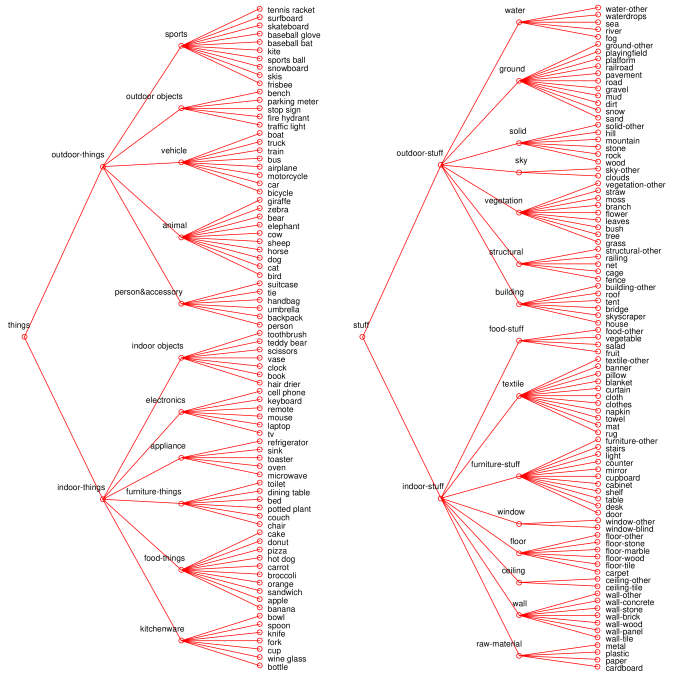

# Object detection

## Description
This is a project for detecting objects in a video. The worflow is as follow:

1) input: video to be analyzed
2) object detection by the deep learning model
3) output: a csv with the labels and the area for each object calculated from the bounding boxes <br /><br >

### Deep learning model

The model is a [Panoptic Segmentation](https://research.fb.com/wp-content/uploads/2019/05/Panoptic-Segmentation.pdf) model that is available by using the **[detectron2 library](https://github.com/facebookresearch/detectron2)** from Facebook AI Research. The model is open source (Apache 2.0 License).


To download the model: [here](https://dl.fbaipublicfiles.com/detectron2/COCO-PanopticSegmentation/panoptic_fpn_R_50_3x/139514569/model_final_c10459.pkl)


For the list of the models available in the detectron2 library: [See here](https://github.com/facebookresearch/detectron2/blob/main/MODEL_ZOO.md)

</br>

The model ([panoptic_fpn_R_50_3x](https://arxiv.org/abs/1901.02446)) is a pre-trained model that was trained on the COCO-Stuff Dataset, which comprises 182 classes ([91 things classes & 91 stuff classes](https://github.com/nightrome/cocostuff/blob/master/labels.md))

#### Labels

</br>


## Deployment

The deployement was tested on a EC2 instance from AWS Amazon cloud service. 

Instance:
> t2.small

Image:
> AMI Deep learning Ubuntu 18.04 (pytorch preinstalled)


Commands:

```
conda activate pytorch_latest_p37
pip3 install ninja pandas pyyaml==5.1
pip install detectron2 -f https://dl.fbaipublicfiles.com/detectron2/wheels/cu101/torch1.8/index.html
```